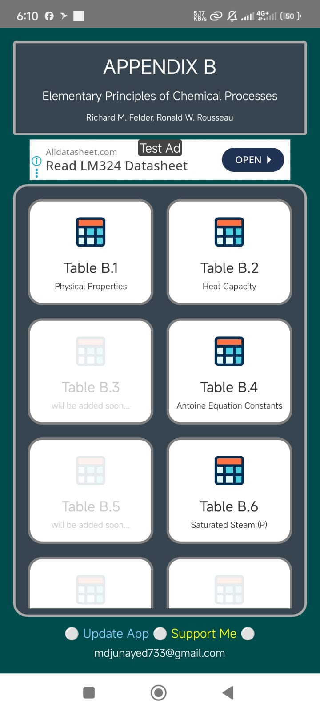

# Appendix B - Felder & Rousseau

This is an Android app designed for quick access to **Appendix B** of *Elementary Principles of Chemical Processes* by Richard M. Felder and Ronald W. Rousseau.

## Download & Community

- **Download APK:** [Appendix_B.apk](https://github.com/j-unayed/Appendix-B-Felder-Rousseau/releases/download/android/appendix_B.apk)  
- **Download APK (Mirror link):** [Uptodown](https://appendix-b.en.uptodown.com/android)  

## Community
 
- **Reddit discussion:** [What people from all over the world are saying](https://www.reddit.com/r/ChemicalEngineering/comments/1ggaygf/android_app_for_appendix_b_of_elementary/)  
- **ChemicalBUET discussion:** [What allumni and current students are saying](https://www.facebook.com/groups/300813446745211/permalink/2801251783368019/?rdid=CGaI0cQh7RKNsEdB#)

## About the App

The app currently includes:

- **Tables included:** B.1, B.2, and B.4  
- **Search functionality:** Users can search by **component name** or **chemical formula**  

### Screenshots

  
  

  
  

  
  

  
  

### Special Features

- **Table B.2 – Heat Capacity Data**
  - Includes a **CpdT Integral Calculator** directly below the displayed heat capacity constants  
  - No need to manually input constants for calculations  

- **Table B.4 – Vapor Pressure Data**
  - Includes a **Vapor Pressure Calculator**  
  - Automatically uses the constants displayed in the table  

### Compatibility

- Requires **Android 7.0+**  

### Notes

- Remaining tables will be added in future updates  
- Users will be notified within the app when new tables are available  

Try the app and provide feedback to help improve it!
